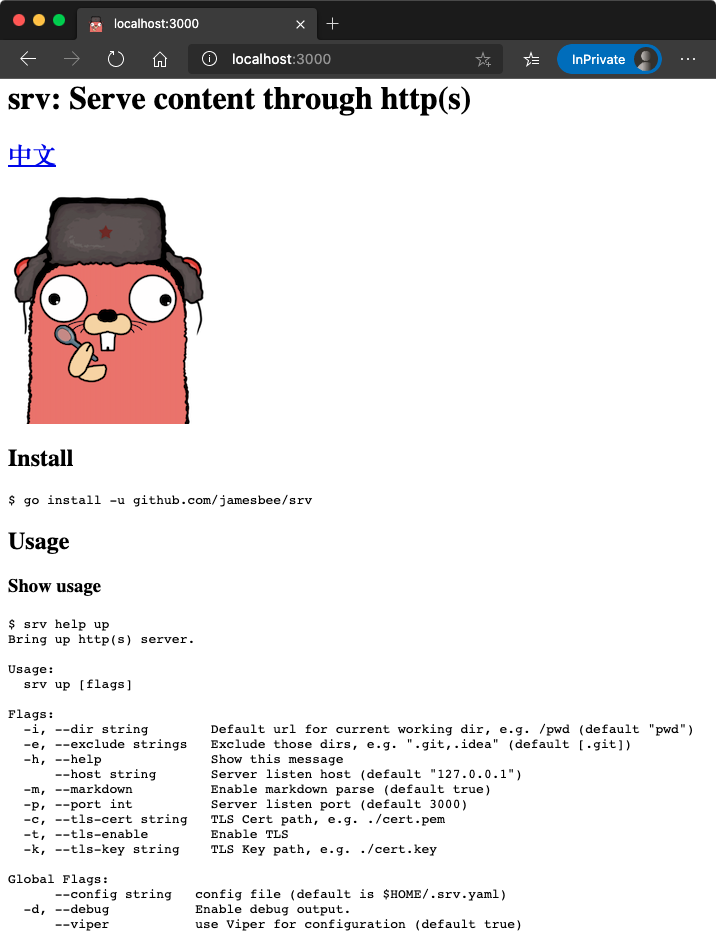

# srv: Serve content through http(s)

## [中文](./docs/README_cn.md)


## Install

```bash
$ go install -u github.com/jamesbee/srv
```

## Usage

### Show usage

```bash
$ srv help up
Bring up http(s) server.

Usage:
  srv up [flags]

Flags:
  -i, --dir string        Default url for current working dir, e.g. /pwd (default "pwd")
  -e, --exclude strings   Exclude those dirs, e.g. ".git,.idea" (default [.git])
  -h, --help              Show this message
      --host string       Server listen host (default "127.0.0.1")
  -m, --markdown          Enable markdown parse (default true)
  -p, --port int          Server listen port (default 3000)
  -c, --tls-cert string   TLS Cert path, e.g. ./cert.pem
  -t, --tls-enable        Enable TLS
  -k, --tls-key string    TLS Key path, e.g. ./cert.key

Global Flags:
      --config string   config file (default is $HOME/.srv.yaml)
  -d, --debug           Enable debug output.
      --viper           use Viper for configuration (default true)
```

### Serve immediately

Type `srv up` and serve current working dir on [http://127.0.0.1:3000](http://127.0.0.1:3000). 

You can always visit `/index` or `/index.html` to get all mapped routes
(only if you are not serving your custom `index.html` file).

e.g.

```bash
$ cd server && srv up
```

Visit [http://localhost:3000/server](http://127.0.0.1:3000/server) and you will get:

> 
> <h2>Files</h2>
> <ul>
> <li><a href="/server/engine.go">server/engine.go</a></li>
> <li><a href="/server/index.go">server/index.go</a></li>
> <li><a href="/server/init.go">server/init.go</a></li>
> <li><a href="/server/serve_dir.go">server/serve_dir.go</a></li>
> <li><a href="/server/serve_file.go">server/serve_file.go</a></li>
> <li><a href="/server/utils.go">server/utils.go</a></li>
> </ul>
>

### Serve markdown

`srv` parse mark down files to html by default, you can disable this
feature by passing `srv up -m false`

```
$ srv up README.md
```

> 

### Serve File

If `srv up` receive a single file as argument, then no rotue info page whould generate, 
it'll serve that file at `/`, `/index`, `/index.html`, `/{FILE_NAME}.html` at the sametime.

```bash
#    `curl 127.0.0.1:8080`
# OR `curl 127.0.0.1:8080/index.html`
# OR `curl 127.0.0.1:8080/foo.html`
$ srv -p 8080 up foo.html
```

If multiple file (e.g. `srv up foo.html bar.html`) or directory has been passed to `srv up`, then `/`, `/index`, `/index.html` would be routes info, and
serve content individually at request path that names after the file like `/foo.html`, `/path/to/bar.html`.

```bash
$ srv up main.go README.md
⇨ http server started on 127.0.0.1:3000
```

> 


### Serve Mixed

You can always serve file alone side with directories.

```bash
#    `curl 127.0.0.1:3000`
#    `curl 127.0.0.1:3000/foo.html`
# OR `curl 127.0.0.1:3000/www`
# OR `curl 127.0.0.1:3000/www/foo.html`
$ srv up foo.html www/
```
