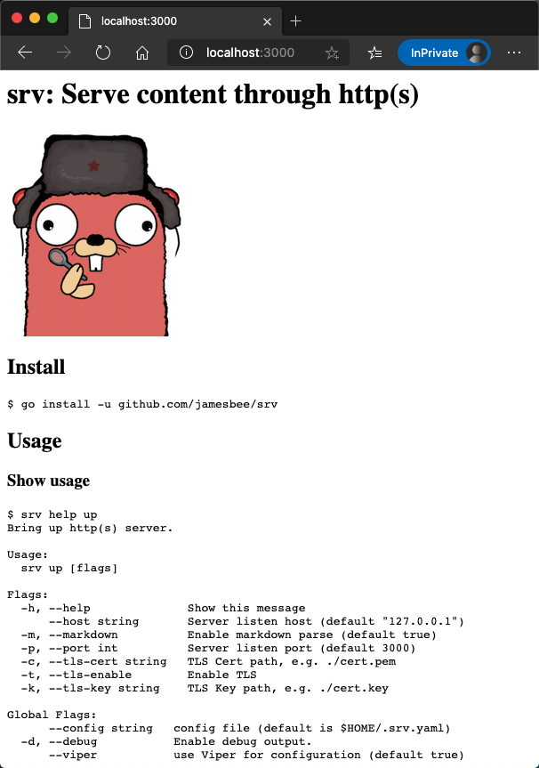
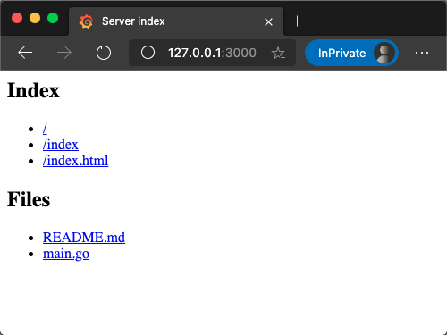

# srv: 通过 http(s) 调试本地文件（夹）


## 安装

```bash
$ go install -u github.com/jamesbee/srv
```

## 使用

### 查看使用帮助

```bash
$ srv help up
Bring up http(s) server.

Usage:
  srv up [flags]

Flags:
  -h, --help              Show this message
      --host string       Server listen host (default "127.0.0.1")
  -m, --markdown          Enable markdown parse (default true)
  -p, --port int          Server listen port (default 3000)
  -c, --tls-cert string   TLS Cert path, e.g. ./cert.pem
  -t, --tls-enable        Enable TLS
  -k, --tls-key string    TLS Key path, e.g. ./cert.key

Global Flags:
      --config string   config file (default is $HOME/.srv.yaml)
  -d, --debug           Enable debug output.
      --viper           use Viper for configuration (default true)
```

### 快速拉起当前目录

输入 `srv up` 将直接拉起当前目录到 [http://127.0.0.1:3000](http://127.0.0.1:3000).

启动完成后可以访问 `/index` or `/index.html` 查看生产的路由信息（除非你有一个叫 `index.html` 
的文件，那么默认路由首页会被覆盖），`srv up` 命令会针对每一个文件生产一个独立的访问路径。

示例：

```bash
$ cd server && srv up
```

打开 [http://localhost:3000/server](http://127.0.0.1:3000/server) 会展示如下信息:

> 
> <h2>Files</h2>
> <ul>
> <li><a href="/server/engine.go">server/engine.go</a></li>
> <li><a href="/server/index.go">server/index.go</a></li>
> <li><a href="/server/init.go">server/init.go</a></li>
> <li><a href="/server/serve_dir.go">server/serve_dir.go</a></li>
> <li><a href="/server/serve_file.go">server/serve_file.go</a></li>
> <li><a href="/server/utils.go">server/utils.go</a></li>
> </ul>
>

### Markdown 支持

`srv` 默认将 Markdown 文件转换为 html 文件，你可以通过开关 `srv up -m false` 将该特性关闭

```
$ srv up README.md
```

> 

### 发布文件

若 `srv up` 只接收到一个文件名称, 将不会有路由信息生成，该文件直接发布到 `/`, `/index`, `/index.html`, 
`/{你的文件名}.html` 这个四个路径.

```bash
#    `curl 127.0.0.1:8080`
# OR `curl 127.0.0.1:8080/index.html`
# OR `curl 127.0.0.1:8080/foo.html`
$ srv -p 8080 up foo.html
```

`srv up` 收到了若多个文件 (例如 `srv up foo.html ./a/b/z.html bar/`) 或目录名, 那么 `/`, `/index`, `/index.html`
展示的是路由信息，并自动生成到文件名的 url `/foo.html`, `/a/b/z.html`.

```bash
$ srv up main.go README.md
⇨ http server started on 127.0.0.1:3000
```

> 


### 混合发布

当然，你可以同时拉起文件和目录。

```bash
#    `curl 127.0.0.1:3000`
#    `curl 127.0.0.1:3000/foo.html`
# OR `curl 127.0.0.1:3000/www`
# OR `curl 127.0.0.1:3000/www/foo.html`
$ srv up foo.html www/
```
